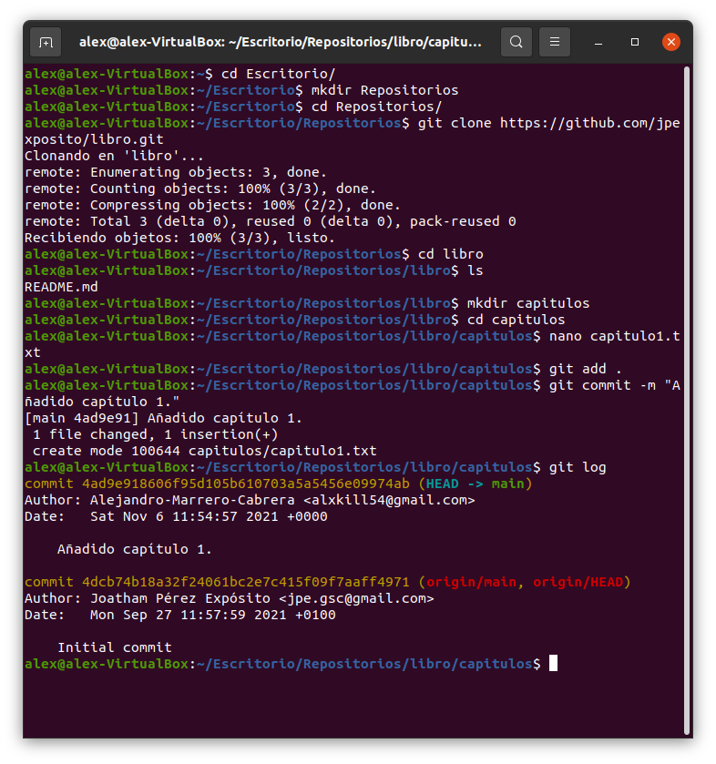
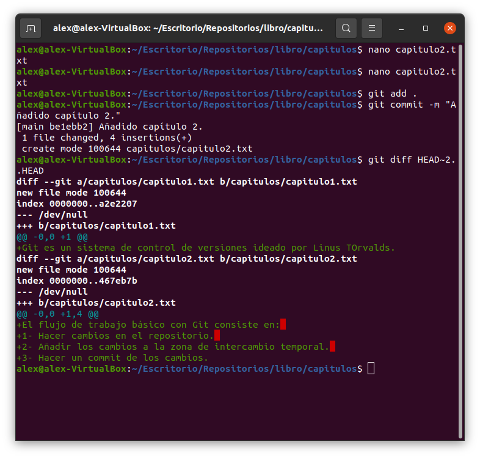
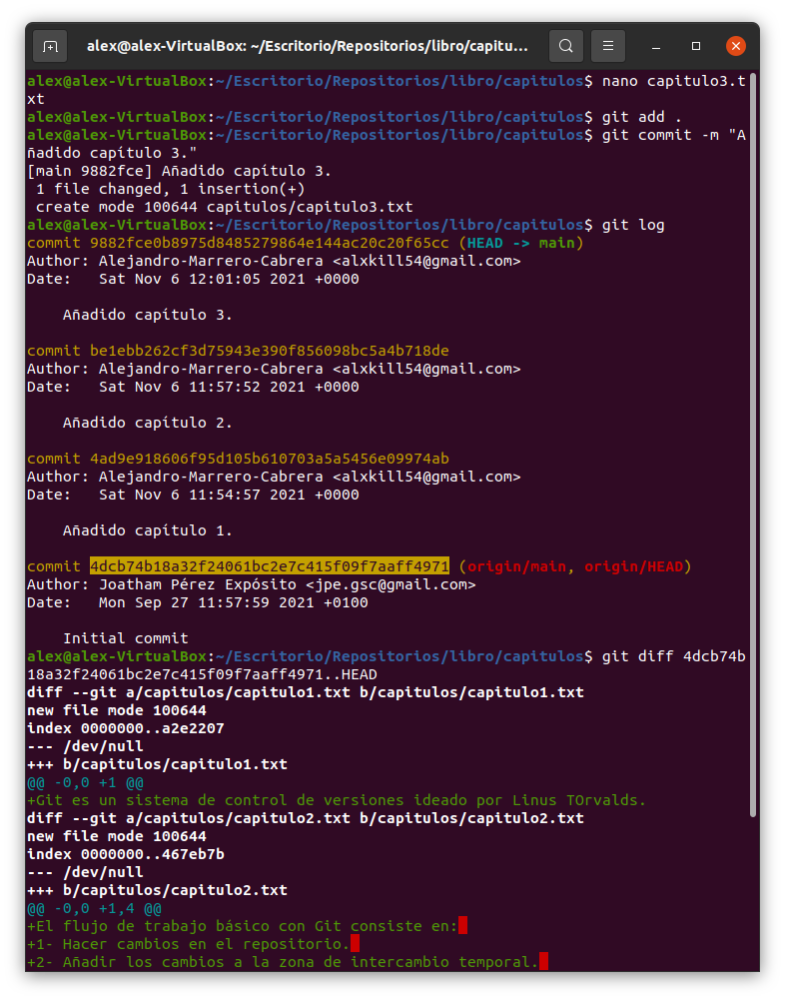
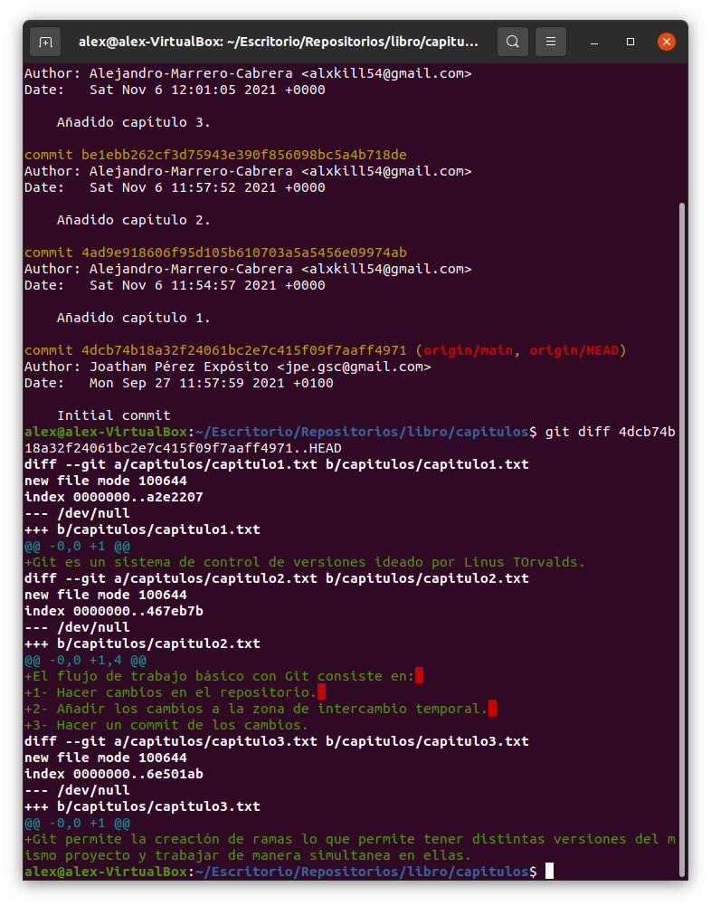

# Manipulación avanzada git

##### Para hacer estos ejecicios, antes he clonado el repositorio de https://github.com/jpexposito/libro con los siguientes comandos:

```
git clone https://github.com/jpexposito/libro 
cd libro
```
## Ejercicio 1: 

- Aquí mostré el historial de cambios del repositorio.
- creé la carpeta capítulos y dentro de ella un fichero (.txt) con texto dentro.
- Añadí los cambios a la zona de intercambio temporal.
- Hice un commit.
- Se mostró de nuevo el historial de cambios. 

<div>

</div>

## Ejercicio 2:
- Se ha creado el fichero cap2.txt
- Se ha añadido los cambios a la zona de intercambios temporal.
- Se ha hecho un commit de los cambios con el mensaje Añadido cap 2.
- Se han mostrado las diferencias entre la última version y dos versiones anteriores.

<div>

</div>

## Ejercicio 3:
- Se ha creado el fichero cap.3 en la carpeta capitulos con texto dentro.
- Se ha añadido los cambios a la zona de intercambio temporal.
- Se hizo un commit de los cambios.
- Se mostraron las diferencias entre la primera y última version del repositorio.
<div>


</div>

## Ejercicio 4:
- Se ha creado el fichero indice.
- Se ha añadido los cambios a la zona de intercambio temporal.
Se hizo un commit
- Se mostró quien ha hecho cambios en el fichero indice.txt.

<div>

</div>

## Ejercicio 5:
- Se ha creado una nueva rama bibliografica se han mostrado las ramas del repositorio.
<div>

</div>

## Ejercicio 6:
- Se ha creado el fichero cap.4 y se ha añadido texto en este.
- Se ha añadido los cambios a la zona de intercambio temporal.
- Se ha hecho un commit.
-  Se ha mostrado la historia del repositorio incluyendo todas las ramas.
<div>

</div>

## Ejercicio 7:
- Se ha cambiado a la rama bibliografia.
- Se ha creado el fichero bibliografia.
- Se ha añadido los cambios a la zona temporal.
- Se ha hecho un commit con un mensaje.
- Se ha mostrado la historia del repositorio incluyendo todas las ramas.
<div>

</div>

## Ejercicio 8:
- Se ha fusionado la rama bibliografia con la rama principal.
- Se ha mostrado la historia del repositorio incluyendo todas las ramas.
- Se ha eliminado la rama bibliografia.
- Se ha mostrado de nuevo la historia del repositorio.
<div>

</div>

## Ejercicio 9:
- Se ha creado la rama bibliografia y se ha cambiado a esa rama.
- Se ha cambiado el fichero. bibliografia para que contenga un texto determinado.
- Se ha cambiado a la rama main.
- Se ha cambiado el fichero.bibliografia para que tenga otras referencias.
- Se han añadido los cambios a la  zona de intercambio temporal y se hizo un commit.
- Se ha resuelto un conflicto dejando el fichero bibliografia con referencias.
- Se ha añadido los cambios a la zona temporal y se ha hecho un commit.
- Se ha mostrado la historia del repositorio incluyendo todas las ramas.
<div>


</div>
